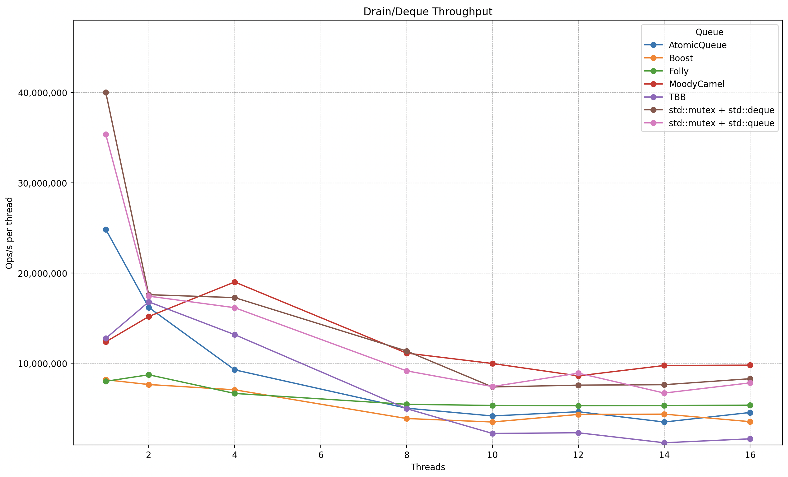

# FastQ++
A collection of low-latency thread-safe lock-free queues consisting of a single producer single consumer (SPSC), single producer multi-consumer (SPMC), and a multi-producer multi-consumer (MPMC) variants.
These queues are all implemented with a shared memory ring buffer model and have been benchmarked against a variety of other concurrent queues listed as:
- [MoodyCamel Queue](https://github.com/cameron314/concurrentqueue)
- [Atomic Queue](https://github.com/max0x7ba/atomic_queue)
- [Folly MPMC Queue](https://github.com/facebook/folly)
- [Boost Lock-free Queue](https://www.boost.org/doc/libs/latest/doc/html/lockfree.html)
- [TBB Concurrent Queue](https://www.intel.com/content/www/us/en/docs/onetbb/developer-guide-api-reference/2021-9/concurrent-queue-classes.html)
****

## Baseline Statistics and Testing Methodology
To start off, we first need to set a baseline which will also serve as a goal to reach/beat.
This baseline is for just drain/deque and heavy concurrent operations, this is because the main focus of this project is the SPMC queue and not the SPSC and MPMC queues.

Testing is done in [test.cpp](testing/test.cpp) and can be altered for different payloads and queue sizes.
****

## Single Producer Single Consumer (SPSC)
Similar to how the SPMC queue is inspired by a CppCon talk, the SPSC queue is also inspired by another one. In particular, the SPSC is heavily inspired by [Single Producer Single Consumer Lock-free FIFO From the Ground Up – Charles Frasch – CppCon 2023](https://www.youtube.com/watch?v=K3P_Lmq6pw0).
The queue implementation discussed in that talk can also be found on this [GitHub repository](https://github.com/CharlesFrasch/cppcon2023)
